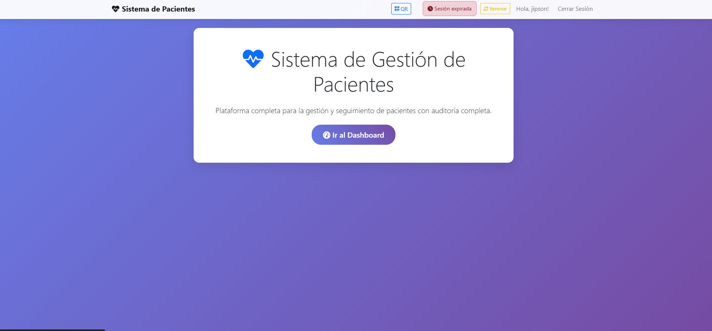
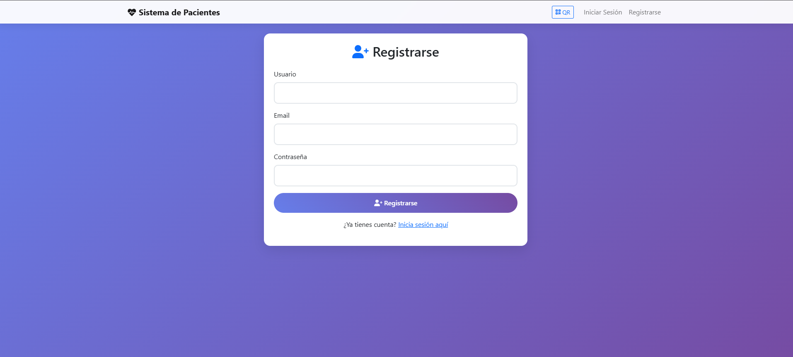
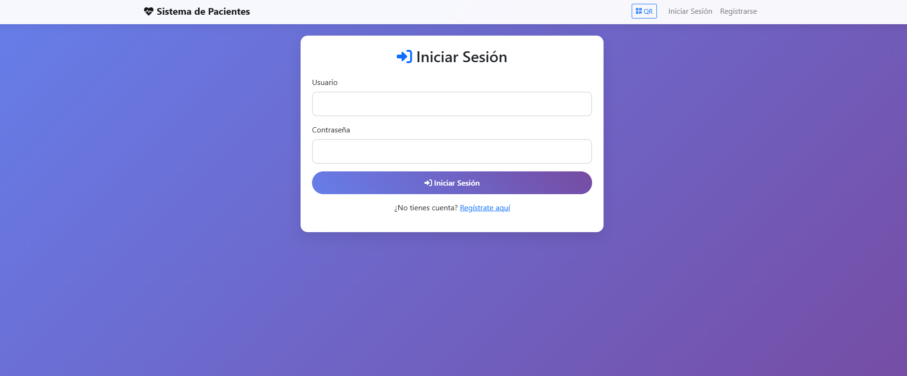
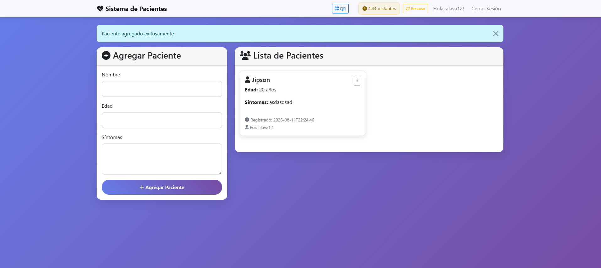

# API de Registro de Pacientes

API y plataforma web para el registro, consulta y seguimiento básico de pacientes. Incluye autenticación de usuarios, gestión de sesiones y trazabilidad de los registros creados.

## Demo en línea

**[Abrir demo](https://apiregistropacientes.onrender.com/)**

> La primera carga puede tardar unos minutos. El servidor está desplegado en un plan gratuito de Render y puede entrar en suspensión cuando no recibe actividad.

> La demo debe usarse únicamente con datos ficticios. No ingreses información médica ni datos personales reales.

## Funcionalidades

- Registro e inicio de sesión de usuarios.
- Gestión de sesión con renovación.
- Registro de pacientes: nombre, edad y síntomas.
- Listado de pacientes registrados.
- Auditoría básica: usuario y fecha de creación del registro.
- Interfaz responsiva para operar desde navegador.
- Acceso mediante código QR.

## Capturas

### Inicio

### Registro e inicio de sesión

### Gestión de pacientes

## Uso de la demo

1. Abre la [demo](https://apiregistropacientes.onrender.com/).
2. Crea una cuenta de prueba desde **Registrarse**.
3. Inicia sesión.
4. Registra pacientes utilizando información ficticia.
5. Consulta, edita o elimina los registros disponibles.

## Seguridad y privacidad

Este proyecto es una demostración técnica. No está diseñado para almacenar información clínica real ni debe utilizarse como sistema médico en producción sin implementar controles adicionales de seguridad, privacidad y cumplimiento normativo.
